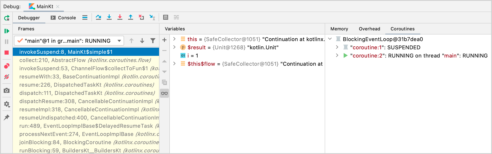

# Coroutine context and dispatchers

## Table of Contents
* [Dispatchers and threads](#dispatchers-and-threads)
* [Unconfined vs confined dispatcher](#unconfined-vs-confined-dispatcher)
* [Debugging coroutines and threads](#debugging-coroutines-and-threads)
* [Jumping between threads](#jumping-between-threads)

Coroutines always execute in some context represented by a value of the `CoroutineContext` type.
It is made up of various elements, mainly Job and a dispatcher.

The dispatcher is covered in this section.

## Dispatchers and threads

The coroutine context includes a coroutine dispatcher that determines what thread or threads 
the corresponding coroutine uses for its execution.

The coroutine dispatcher can confine coroutine execution to a specific thread, dispatch it to 
a thread pool, or let it run unconfined.

All coroutine builders like launch and async accept an optional CoroutineContext parameter 
that can be used to explicitly specify the dispatcher for the new coroutine and other context 
elements.

```kotlin
launch { // context of the parent, main runBlocking coroutine
    println("main runBlocking      : I'm working in thread ${Thread.currentThread().name}")
}
launch(Dispatchers.Unconfined) { // not confined -- will work with main thread
    println("Unconfined            : I'm working in thread ${Thread.currentThread().name}")
}
launch(Dispatchers.Default) { // will get dispatched to DefaultDispatcher 
    println("Default               : I'm working in thread ${Thread.currentThread().name}")
}
launch(newSingleThreadContext("MyOwnThread")) { // will get its own new thread
    println("newSingleThreadContext: I'm working in thread ${Thread.currentThread().name}")
}
```
The output of this program will be
```
Unconfined            : I'm working in thread main
Default               : I'm working in thread DefaultDispatcher-worker-1
newSingleThreadContext: I'm working in thread MyOwnThread
main runBlocking      : I'm working in thread main
```
<br />

> The default dispatcher that is used when coroutines are launched in GlobalScope is 
> represented by Dispatchers.Default and uses a shared background pool of threads, so 
> launch(Dispatchers.Default) { ... } uses the same dispatcher as GlobalScope.launch { ... }.

> newSingleThreadContext creates a thread for the coroutine to run. A dedicated thread is a 
> very expensive resource. In a real application it must be either released, when no longer 
> needed, using the close function, or stored in a top-level variable and reused throughout 
> the application.

## Unconfined vs confined dispatcher

The `Dispatchers.Unconfined` coroutine dispatcher starts a coroutine in the caller thread, but
only until the first suspension point, i.e. until a suspend method is encountered. 

After suspension, it resumes the coroutine in the thread that is fully determined by the suspending 
function that was invoked, i.e. if the suspend function switches to a different thread, when the 
coroutine resumes after executing the suspend function, the coroutine will execute in the same thread
as the called suspend function. In that sense, the dispatcher's execution is `unconfined`.

The unconfined dispatcher is appropriate for coroutines which neither consume CPU time not update
any shared (like UI) confined to a specific thread.

> On the other side, the dispatcher is inherited from the outer CoroutineScope by default, i.e. if 
> unspecified. 

> The default dispatcher from the `runBlocking` coroutine, in particular, is confined to the invoker
> thread, so inheriting it has the effect of confining execution to this thread with predictable FIFO
> scheduling. In simple words, using runBlocking on the main thread will use main within the coroutine
> for example.

```kotlin
fun main() = runBlocking<Unit> {
    launch(Dispatchers.Unconfined) { // not confined -- will work with main thread
        println("Unconfined      : I'm working in thread ${Thread.currentThread().name}")
        delay(500)
        println("Unconfined      : After delay in thread ${Thread.currentThread().name}")
    }
    launch { // context of the parent, main runBlocking coroutine
        println("main runBlocking: I'm working in thread ${Thread.currentThread().name}")
        delay(1000)
        println("main runBlocking: After delay in thread ${Thread.currentThread().name}")
    }    
}
```
The output of this program will be
```
runBlocking     : I'm working in thread main @coroutine#1
Unconfined      : I'm working in thread main @coroutine#2
main runBlocking: I'm working in thread main @coroutine#3
Unconfined      : After delay in thread kotlinx.coroutines.DefaultExecutor @coroutine#2
main runBlocking: After delay in thread main @coroutine#3
```

So, the coroutine with the context inherited from `runBlocking {...}` continues to execute in the
`main` thread, while the unconfined one resumes in the default executor thread that the `delay` 
function is using.

## Debugging coroutines and threads

Coroutines can suspend on one thread and resume on another, e.g. when using Dispatchers.Unconfined.

Even with a single-threaded dispatcher it might be hard to figure out what the coroutine was doing,
where, and when if you don't have special tooling.

For example, say you run a coroutine with a delay suspending function. Running it on the main thread
is main safe because `delay` internally switches to another thread while the coroutine is suspended
on the main thread. It is important to be able to track where what work is happening.

### Debugging with IDEA

The **Debug** tool window contains the **Coroutines** tab. This tab contains information about both 
currently running and suspended coroutines. 
> The coroutines are grouped by the dispatchers they are running on.



### Debugging using logging

Another approach to debugging applications with threads without Coroutine Debugger is to print the 
thread name in the log file on each log statement. This feature is universally supported by logging
frameworks. 

When using coroutines, the thread name alone does not give much of a context, so `kotlinx.coroutines`
includes debugging facilities to make it easier.

Run the following code with `-Dkotlinx.coroutines.debug` JVM option:
```kotlin
import kotlinx.coroutines.*

fun log(msg: String) = println("[${Thread.currentThread().name}] $msg")

fun main() = runBlocking<Unit> {
    val a = async {
        log("I'm computing a piece of the answer")
        6
    }
    val b = async {
        log("I'm computing another piece of the answer")
        7
    }
    log("The answer is ${a.await() * b.await()}")    
}
```
The output of this program will be
```
[main @coroutine#2] I'm computing a piece of the answer
[main @coroutine#3] I'm computing another piece of the answer
[main @coroutine#1] The answer is 42
```

## Jumping between threads
```kotlin
    newSingleThreadContext("Ctx1").use { ctx1 ->
        newSingleThreadContext("Ctx2").use { ctx2 ->
            runBlocking(ctx1) {
                log("Started in ctx1")
                withContext(ctx2) {
                    log("Working in ctx2")
                }
                log("Back to ctx1")
            }
        }
    }    
```

The code above demonstrates how runBlocking can be used with an explicit context. It also shows how
withContext can be used to switch context while still executing within the same coroutine.

The output of this program will be
```
[Ctx1 @coroutine#1] Started in ctx1
[Ctx2 @coroutine#1] Working in ctx2
[Ctx1 @coroutine#1] Back to ctx1
```
